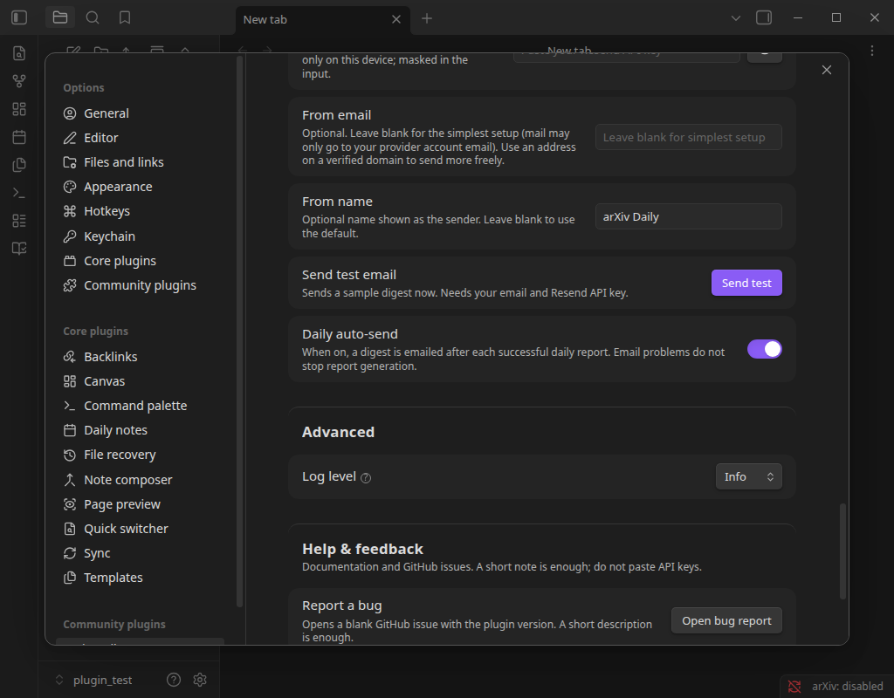
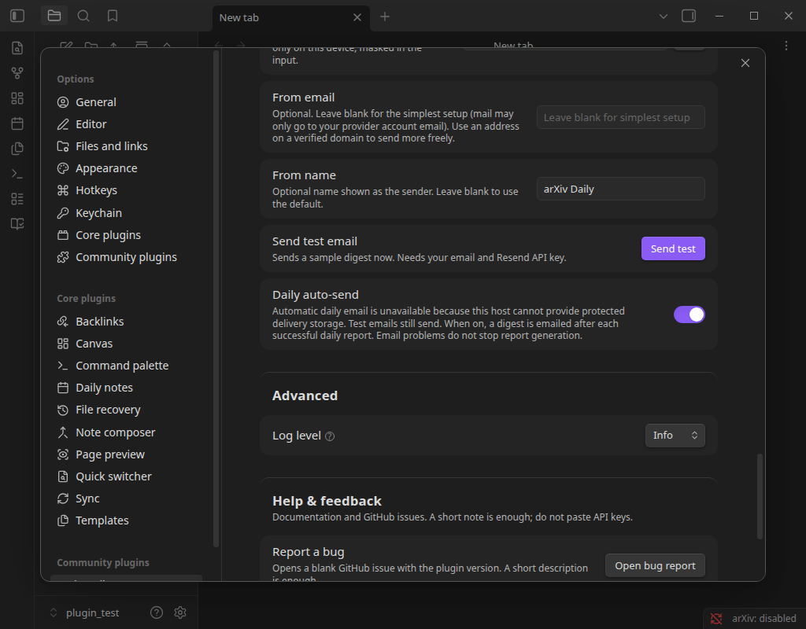

# P6 desktop native acceptance

## Scope and environment

Only `/home/tiandc/Desktop/plugin_test` was opened. A fresh application configuration, Xvfb display, and temporary HOME isolated the run from the production Vault and user native cache. The plugin was built from the current repository; its SHA-256 remains identical after the source-hash build fix. The build stays deployed in the designated test Vault.

Observed host: Obsidian 1.11.5, Electron 39.2.6, Node 22.21.1, Node-API 10, Linux x64. The embedded component uses Node-API v8. This is real desktop-host evidence on Linux; macOS/Windows evidence comes from the separate native CI matrix. No claim of real Windows/macOS Obsidian execution is made.

## Method and observed results

The existing `runDesktopSession` harness deployed the built plugin, attached CDP before accepting Vault trust, confirmed the mounted Vault and plugin version, collected renderer diagnostics, and reclaimed only its own process group. `installSettingsFixture` disabled scheduling and replaced credentials with fixtures before launch. The harness restored the original settings store and workspace after every session.

1. Inspect the loaded plugin's selected storage adapter: the native backend is present and `automaticEmailSupported()` is true.
2. Through that adapter, create a private file exclusively; the second create loses and cannot overwrite it. Open it through the native binding and require `isPrivate()` to succeed.
3. Replace a private primary atomically, then arrange a backup plus uncommitted temporary file; recovery restores the authoritative content and removes the temporary.
4. Acquire the claim namespace guard, move and replace its directory within the test Vault, and require synchronous rejection. A released guard also rejects use.
5. Intercept `host.http.request` before invoking the real `deliverCompletedDigest` handler; only the expected Resend URL with the fixture recipient is accepted, and a fake response is returned without network delivery. Two invocations produce exactly one request and a delivered record.
6. Start a separate real Obsidian session against the same test records. Both invocations produce zero requests. A separate Node process using `buildNodeHostAdapters` and the production Core delivery function returns `skipped / already_delivered`, with zero requests and the native backend selected.
7. Open the actual settings tab and click Daily auto-send on, then off; observe the persisted in-session settings change. Temporarily remove the guard capability in the isolated process, redraw the tab and require the explicit unsupported-storage message; restore the capability and observe support returning.
8. Require complete startup diagnostics and zero renderer errors. Compare settings/workspace SHA-256 with the pre-run snapshots, and remove only the generated acceptance namespace within the test Vault.

All checks passed. [Machine-readable results](desktop-native-acceptance.json) contain runtime versions, exact request counts, artifact hashes and probe provenance. The probe sources and logs remain under `/tmp/arxiv-p6-desktop/` on the acceptance machine. Fixtures contain no real provider key or recipient; no real email or provider request was sent.

## Visual evidence

## CI and full matrix assembly

[Native run 36733252120](https://github.com/tdccccc/arxiv-daily/actions/runs/36733252120) passes all six OS/architecture jobs and Native release asset assembly. The same-run artifacts were also downloaded and independently accepted by `readNativeAssets` for all six targets on the acceptance machine. Root run 36733252255, relay run 36733252368, CodeQL run 36733252168 and VS Code run 36733252297 all pass on the same implementation commit.
