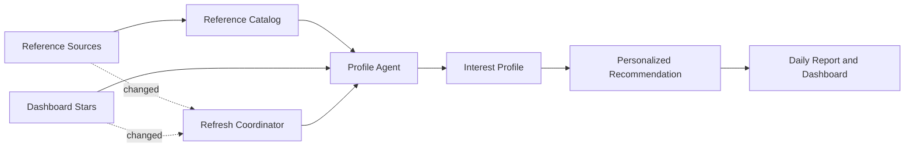

# 个性化文献推荐 Agent：总体方案

> 日期：2026-07-13
> 状态：规划完成，待实施
> 任务目录：`docs/tasks/2026-07-13-personalized-literature-agent/`

## 1. 目标

在不训练专属模型的前提下，让 arXiv Daily 根据用户已有的文献库生成兴趣画像，并用这份画像自动筛选和推荐每日新论文。

核心流程保持简单：

```text
用户指定文献库来源
    ↓
系统搜集、解析并去重文献
    ↓
根据全部文献生成兴趣画像
    ↓
自动确定候选范围并排序
    ↓
展示推荐论文和推荐理由
    ↓
根据文献库变化和 Dashboard 标星更新画像
```

目录、Zotero、JabRef、BibTeX 等只负责提供文献。兴趣方向由 Agent 根据全部文献内容自动归纳，不要求用户维护目录分组、collection 映射或手工 topics。

## 2. 要解决的问题

当前 arXiv Daily 主要依赖用户手工配置 arXiv category 和 topics。这种方式可控，但存在三个问题：

1. 新用户需要先把自己的研究兴趣整理成 topics，冷启动成本较高；
2. 用户已有文献库没有被利用；
3. 文献库和 Dashboard 标星发生变化后，推荐策略不会随之更新。

本任务要提供一个更自然的入口：

> 把自己的文献库交给系统，系统自动理解主要研究方向并推荐相关新论文。

## 3. 产品范围

### 3.1 文献库来源

用户可以配置一个或多个来源：

- Vault 内的文献目录；
- 包含多级子目录的文献目录；
- BibTeX、Better BibTeX、RIS 或 CSL JSON 导出文件；
- 可识别 arXiv ID 或 DOI 的 PDF；
- 后续接入 Zotero、JabRef 等文献管理软件。

来源只定义“到哪里搜集文献”。

系统不会假设：

- 一个目录只代表一个研究方向；
- 一个子目录一定对应一个兴趣；
- Zotero collection 或 JabRef group 必须映射成兴趣簇。

无论目录是平铺还是多级结构，系统都把搜集到的全部文献合并到统一 catalog，再根据文献内容自动生成兴趣画像。

### 3.2 兴趣画像

兴趣画像是一份简单、结构化的用户研究兴趣描述，可以包含多个方向。

每个方向首版只需要：

- 名称；
- 一段简短描述；
- 关键词；
- 建议关注的 arXiv categories；
- 若干代表文献。

例如：

```text
兴趣画像
├── LLM Agent 与工具调用
├── 长期记忆与上下文管理
└── 科学文献检索与 RAG
```

这些方向由 Agent 从全部文献中自动归纳，不直接等同于目录名、collection 或 tag。

用户可以查看画像、启用或停用某个方向，并手动重新生成画像。首版不提供复杂的合并、拆分、层级编辑和版本管理界面。

### 3.3 个性化推荐

插件保留两种模式：

| 模式 | 行为 |
|---|---|
| Manual | 保持当前 category + topic 流程 |
| Personalized | 使用兴趣画像自动确定候选范围并推荐论文 |

现有用户默认保持 `Manual`。只有用户配置文献库并成功生成画像后，才能开启 `Personalized`。

Personalized 模式执行：

1. 从兴趣画像得到需要关注的 arXiv categories 和关键词；
2. 抓取当日候选论文；
3. 根据标题、摘要和兴趣画像进行相关性排序；
4. 选择最相关的论文进入日报；
5. 为每篇论文生成简短推荐理由。

推荐理由示例：

> 推荐原因：与你文献库中的长期记忆和 Agent 上下文管理方向相关，本文重点研究跨会话记忆压缩。

首版不引入复杂的 embedding provider、学习排序模型或多层评分系统。优先复用现有 LLM，根据有限候选进行结构化判断。

### 3.4 自动更新画像

首版只使用两类兴趣信号：

1. 用户文献库中的当前文献；
2. Dashboard 中当前标星的论文。

更新规则：

- 文献库新增论文：加入画像证据；
- 文献或笔记发生修改：更新对应证据；
- 文献被删除：不再作为证据，但不视为负反馈；
- Dashboard 标星：作为较强的兴趣证据；
- 取消标星：撤销额外权重，不视为负反馈。

首版不使用：

- `to_read`、`saved`、`ignored`；
- 打开次数和重复浏览；
- 系统自动生成的日报和 detail note；
- 未标星或删除行为所隐含的负向兴趣；
- 新增“喜欢/不喜欢”等必须由用户主动维护的反馈按钮。

目录变化或标星操作只把画像标记为“需要刷新”。系统在固定时间、每日推荐前或用户手动点击时批量更新，不在每次操作后立即调用 LLM。

## 4. 文献搜集与解析

### 4.1 目录扫描

目录配置只包含必要选项：

- 路径；
- 是否递归；
- 支持的文件类型；
- 可选的排除规则；
- 是否启用。

递归扫描用于找到子目录中的文献，但子目录层级不参与首版画像规则。

默认排除：

- `.git`；
- `.obsidian`；
- `.index`；
- `node_modules`；
- arXiv Daily 自动生成的日报和 detail note 目录。

### 4.2 支持格式

首版优先支持：

- Markdown 文献笔记；
- BibTeX/Better BibTeX；
- RIS；
- CSL JSON；
- 文件名或关联元数据中带有 arXiv ID/DOI 的 PDF。

对于 PDF：

1. 优先从文件名、同名 sidecar、BibTeX 或管理器导出数据中识别 arXiv ID/DOI；
2. 根据标识符补全标题、作者和摘要；
3. 无法识别时显示为未解析，不阻断其他文献导入。

首版不引入大型 PDF 全文解析依赖。

### 4.3 多来源合并

用户可以同时配置多个目录或导出文件。

系统按以下标识去重：

1. arXiv ID；
2. DOI；
3. 标准化标题、年份和第一作者；
4. 来源路径。

同一论文出现在多个来源中时，只作为一篇文献参与画像，但保留来源信息用于诊断。

## 5. 简化架构



首版只需要五个核心组件：

| 组件 | 职责 |
|---|---|
| Reference Source Service | 扫描目录和导出文件 |
| Reference Catalog | 解析、去重并缓存文献元数据 |
| Profile Agent | 根据全部文献和标星论文生成兴趣画像 |
| Recommendation Service | 根据画像筛选论文并生成推荐理由 |
| Refresh Coordinator | 检测文献库和标星变化，批量刷新画像 |

新增代码集中放在 `plugin/src/personalization/`，避免继续扩大 `pipeline.ts` 和 `dashboard/view.ts`。

## 6. 本地状态

建议只保存必要文件：

```text
arxiv-daily/.index/personalization/
├── sources.json
├── documents.json
├── profile.json
└── refresh-state.json
```

含义：

- `sources.json`：用户配置的文献来源；
- `documents.json`：解析、去重后的文献 catalog；
- `profile.json`：当前有效兴趣画像；
- `refresh-state.json`：记录上次处理的文献库和标星状态，以及是否需要刷新。

原则：

- JSON 使用 schema version；
- 状态原子写入；
- 构建失败时保留上一份有效画像；
- 不复制原始 PDF 和完整笔记；
- 不额外维护复杂反馈事件历史；
- 画像可由当前 catalog 和标星论文重新生成。

## 7. 与现有代码的关系

优先复用：

- `StorageAdapter`：扫描 Vault 内目录、读取文本和二进制文件；
- `PaperIndexStore`：读取论文元数据和 Dashboard 标星状态（`priority=high`）；
- `ArxivFetcher`：补全文献元数据和抓取每日候选论文；
- `ArxivPipeline`：继续负责日报生成和 detail report；
- `paper-filter.ts`：在 Personalized 模式下改为使用兴趣画像；
- Dashboard：继续使用现有 Star 按钮；
- scheduler/progress/logger：显示刷新和推荐进度。

Manual 模式必须保持当前行为，不读取兴趣画像，也不受个性化模块失败影响。

## 8. Profile Agent

Profile Agent 的输入：

- 当前有效文献 catalog；
- 当前 Dashboard 标星论文。

输出保持简单，只包含画像摘要、兴趣方向、关键词、建议 arXiv categories、代表文献和生成时间。

构建方式：

1. 读取所有有效文献的标题、摘要、关键词和有限长度笔记；
2. 文献较少时直接生成画像；
3. 文献较多时分批提取主题，再合并为最终画像；
4. Dashboard 标星论文给予更高权重；
5. 限制兴趣方向数量和单次 LLM token；
6. 验证 LLM JSON 后再原子替换 `profile.json`。

分批、缓存和增量处理属于内部实现，用户不需要配置聚类方式。

## 9. 推荐流程

Personalized 模式的首版流程：

1. 读取当前有效画像；
2. 汇总已启用兴趣方向的 arXiv categories 和关键词；
3. 在受限范围内获取每日候选论文；
4. 把候选论文的标题和摘要与画像一起交给现有 LLM；
5. 返回是否推荐、命中的兴趣方向和简短原因；
6. 把入选论文交给现有摘要和写入流程。

LLM 对每篇候选只需判断是否推荐、命中的兴趣方向、简短理由，以及是否需要生成 detail report。

每次运行限制候选数量，不能扫描整个 arXiv，也不能把全部文献库内容重复发送给 LLM。推荐只使用已经生成的精简画像。

## 10. 用户界面

### 10.1 设置页

新增 Personalization 区域：

- Enable personalization；
- Mode：Manual / Personalized；
- Reference sources；
- Add folder；
- Add export file；
- Recursive；
- Scan library；
- Build/Refresh profile；
- Last scan 和 last profile update；
- 文献数、未解析数和错误数。

### 10.2 画像查看

提供一个简单页面或 modal：

- 画像摘要；
- 兴趣方向列表；
- 每个方向的描述、关键词和代表文献；
- 启用/停用方向；
- Rebuild profile。

### 10.3 Dashboard

- 保留现有 Star 按钮；
- Personalized 推荐显示简短推荐理由；
- 可显示命中的兴趣方向；
- 不新增必须维护的反馈状态。

## 11. 隐私与资源约束

- 只扫描用户明确配置的来源；
- 默认不扫描整个 Vault；
- 不向 LLM 发送绝对路径；
- 不发送完整 PDF；
- 笔记和摘要按长度截断；
- 自动生成的日报和 detail note 不进入画像；
- 文献内容视为不可信数据，复用现有 prompt injection guard；
- 日志不记录文献全文、笔记全文或 API key；
- 大型文献库使用缓存和分批处理；
- 画像刷新失败不能阻断 Manual 模式和现有日报任务。

## 12. 分阶段实施

| Phase | 名称 | 核心交付 |
|---|---|---|
| P1 | Reference Library Import | 多来源配置、目录递归扫描、格式解析、去重 catalog、扫描预览 |
| P2 | Interest Profile Agent | 从全部文献和标星论文生成简单的多方向兴趣画像 |
| P3 | Personalized Recommendation | 自动确定候选范围、LLM 筛选、推荐理由、Manual/Personalized 切换 |
| P4 | Automatic Refresh and Integrations | 文献库/标星变化检测、批量刷新、Zotero/JabRef 导入完善、性能和诊断 |

每个 Phase 的详细实施计划位于 `plan/`。

## 13. Phase 完成标准

### P1

- 支持一个或多个目录/导出文件；
- 平铺和多级目录都能扫描；
- 目录层级不影响兴趣语义；
- 文献可解析、去重、增量更新；
- 未解析文献可见但不阻断导入。

### P2

- 能从 3～10 篇代表文献生成画像；
- 能从较大文献库分批生成画像；
- 一份画像可包含多个兴趣方向；
- 标星论文具有更高权重；
- 失败时保留上一份有效画像。

### P3

- Personalized 模式不需要用户配置 topics；
- 能根据画像生成候选范围；
- 每篇推荐有简短理由；
- Manual 模式行为保持不变；
- 个性化模块失败时可以安全回退。

### P4

- 文献新增、修改、删除后可触发批量刷新；
- 标星和取消标星能改变画像证据；
- 单次操作不会立即调用 LLM；
- Zotero/JabRef 至少可通过常见导出格式接入；
- 大型文献库重复扫描不会重复处理未变化文献。

## 14. 成功指标

- 用户配置文献库后可以直接生成画像；
- 用户无需理解或维护 grouping 策略；
- 用户无需手工创建 topics 即可获得推荐；
- 多研究方向能在同一画像中被识别；
- 推荐结果能够解释与哪个兴趣方向相关；
- 文献库变化和 Dashboard 标星能影响后续画像；
- 未变化文献不会重复解析或重复消耗 LLM；
- Manual 模式全量测试和构建保持通过。

首轮 dogfood 关注：

- 生成的兴趣方向是否符合用户预期；
- 推荐结果的标星比例；
- 推荐论文进入用户文献库的比例；
- 每次画像生成和推荐的时间/token 成本；
- 用户是否仍需要频繁手工调整 topics。

## 15. 非目标

首版不包含：

- 训练或 fine-tune 用户专属模型；
- 复杂目录 grouping 策略；
- 把 Zotero collection/JabRef group 强制映射成兴趣方向；
- 直接读取 Zotero SQLite；
- PDF 全文解析；
- embedding provider 和向量数据库；
- 复杂画像版本、回滚、合并、拆分和层级编辑；
- 复杂反馈事件、正负反馈权重和时间衰减；
- 根据打开次数、删除或未标星推断兴趣；
- 自动覆盖用户现有 topics；
- 扫描整个 arXiv；
- 在移动端访问任意外部文件系统目录。

## 16. 已确定的原则

1. 文献来源只负责提供文献，不负责定义兴趣方向。
2. 所有来源先合并、解析和去重，再生成一份用户画像。
3. 一份画像可以自动包含多个研究方向。
4. 首版只使用文献库当前内容和 Dashboard 标星。
5. 取消标星和删除文献只撤销证据，不产生负反馈。
6. Manual 模式保持兼容，Personalized 模式由用户主动开启。
7. 推荐使用精简画像，不重复发送完整文献库。
8. 先完成简单端到端闭环，再考虑更复杂的聚类、反馈和外部集成。
